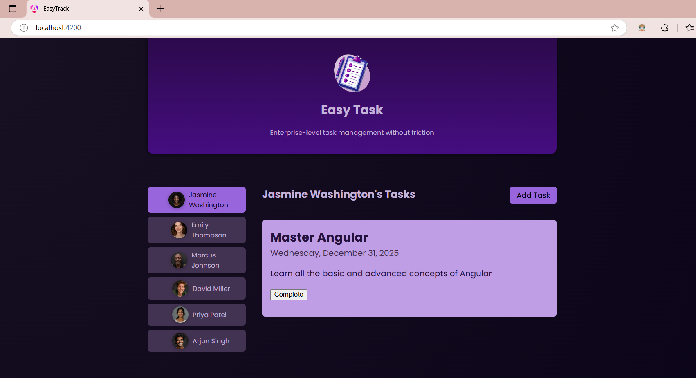
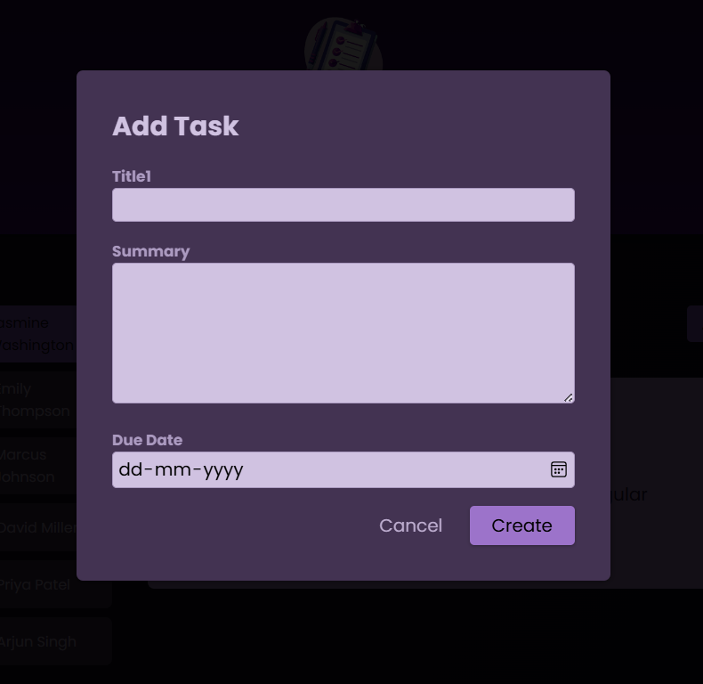

# TaskMate

TaskMate is an enterprise-level task management application built with Angular. It provides a user-friendly interface to manage tasks for different users, allowing users to add, view, and complete tasks efficiently.

## Table of Contents
- [Features](#features)
- [Screenshots](#screenshots)
- [Installation](#installation)
- [Usage](#usage)

## Features

- **User Selection**: Choose a user from the list to view their specific tasks.
- **Task Management**: Add new tasks with a title, summary, and due date, and mark tasks as completed.
- **Responsive Design**: Optimized for desktop, tablet, and mobile view.
- **Reusable Components**: Built with modular components (`app-header`, `app-user`, `app-task`, `app-new-task`).
- **Dialog Support**: Add new tasks using a modal dialog with a form for details.

## Screenshots

### Main Screen


### Add Task Modal


*Note: Add the images in an "images" folder within your project repository, and reference them as shown above.*

## Installation

### Prerequisites
- [Node.js](https://nodejs.org/) and npm (Node Package Manager)
- [Angular CLI](https://angular.io/cli)

### Steps
1. **Clone the repository:**
   ```bash
   git clone https://github.com/ShiwaniKadu/TaskMate.git
   ```
2. **Navigate to the project directory**
   ```bash
   cd TaskMate
   ```
3. **Install dependencies**
   ```bash
   npm install
   ```
4. **Run the application**
   ```bash
   ng serve
   ```

### Open your browser and go to http://localhost:4200 to view TaskMate.

### Usage
- **Select a user from the user list on the left.
- **View the selected user's tasks in the main panel.
- **Click the Add Task button to add a new task. Fill in the title, summary, and due date, then click Create.
- **Mark tasks as completed by clicking the Complete button on each task.


